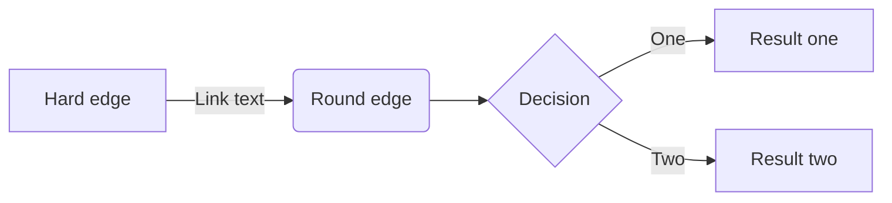

[](https://classroom.github.com/a/0n2F_Zha)
# Game Design Document (GDD)

Read the [project specification](https://github.com/COMP30019/Project-1-Specification) for details on what _actually_ needs to be covered here. While you should (obviously) delete everything here and replace it with an actual GDD before submitting your project, you may wish to keep a copy of it as a cheat sheet for how to use "GitHub flavoured markdown".

Ensure that _your game design document_ is `well written` and formatted **appropriately**. 
Below are examples of markdown features available on GitHub that might be useful, though this is not an exhaustive list, nor is it required that you use all of these features.

### Table of contents
* [Introduction](#introduction)
* [Emojis and Icons :boom:](#emojis-and-icons)
* [Using Images](#using-images)
* [Code Snipets](#code-snippets)
* [Tables and Lists](#tables-and-lists)
* [Maths and Diagrams](#maths-and-diagrams)
* [References](#references)


### Introduction
_Exciting title_ is a first-person shooter (FPS) set in... we're not sure yet. It's a bit like _Doom_ meets _Animal Crossing_, but with a twist. The player must... 

> "This is a quote from the game designer, explaining why this game is going to be the best thing since sliced bread." - Game Designer
>
### Game Overview
This section should describe the general concept of the game, its main themes, and overall player experience. Here are some questions you might want to answer:

Core Concept: What is the core concept of your game? What is the main idea behind your game? Who or what is the "player", and what is their role in the game?
Genre: What genre does your game belong to? What are some other games in this genre? Is the concept inspired by another creative work (could be a game but doesn't have to be)? Remember that the "time survival" mechanic is a requirement for this project, but it doesn't necessarily have to constrain the genre of your game.
Target Audience: Who is your game aimed at? Is there any demographic you are targeting in particular? Note that later this semester you will be required to conduct user testing with your target audience (it should be feasible to easily find people in your target audience to test your game).
Unique Selling Points (USPs): What makes your game unique? What are some of the key features that will make your game stand out from others in the same genre?

### Emojis and Icons

Check out [this page](https://github-emoji-picker.rickstaa.dev/) for a list of emojis/icons that you can use in your markdown. For example, you can use :sparkles: to make things sparkle! Use them sparingly and selectively, as too many emojis can be distracting, and some aren't super appropriate for a GDD. :wink: :wink: :wink:

### Using Images

Remember that your GDD should be a very visual document! It's easy to include images or gifs in your markdown, like this:

<p align="center">
  
</p>

### Code Snippets 

Code is unlikely to be needed much (if at all) in your GDD, but it's still handy to know how to embed it. If you do include any `code snippets`, be sure to explain them properly.

```c#
public class CameraController : MonoBehaviour
{
    void Start ()
    {
        // Do something...
    }
}
```

### Tables and Lists

You can create tables using markdown, though it's a bit fiddly and not super customisable. Here's an example:

| Column 1 | Column 2 | Column 3 |
| -------- | -------- | -------- |
| Row 1    | Row 1    | Row 1    |
| Row 2    | Row 2    | Row 2    |
| Row 3    | Row 3    | Row 3    |

You can also create lists, like this:

* Item 1
* Item 2
* Item 3

Or like this:

1. Item 1
2. Item 2
3. Item 3

Or even nested lists like this:

1. Item 1
    * Item 1.1
    * Item 1.2
2. Item 2
    * Item 2.1
    * Item 2.2


### Maths and Diagrams

Like code, maths probably won't feature much in your GDD, but it's worth knowing that you can use LaTeX to write equations, and have them automatically render in your markdown:

$$\left( \sum_{k=1}^n a_k b_k \right)^2 \leq \left( \sum_{k=1}^n a_k^2 \right) \left( \sum_{k=1}^n b_k^2 \right)$$

... [look here](https://docs.github.com/en/get-started/writing-on-github/working-with-advanced-formatting/writing-mathematical-expressions) if you want to learn more about this.

It's also possible to [create diagrams](https://docs.github.com/en/get-started/writing-on-github/working-with-advanced-formatting/creating-diagrams) via GitHub flavoured markdown using an integrated tool called Mermaid. This is a pretty powerful tool, and it's worth checking out [this](https://mermaid.js.org/intro/) guide for more information on what it can do. As a quick example, here's a flowchart:



Pretty neat, huh? You can also create sequence diagrams, Gantt charts, class diagrams, and more. Check out the [Mermaid Live Editor](https://mermaid-js.github.io/mermaid-live-editor/) to see what's possible.

### References

Need more help? Check out these resources, which everything in this document is based on:

* [GitHub Flavoured Markdown](https://guides.github.com/features/mastering-markdown/) (official guide)
* [GitHub LaTeX](https://docs.github.com/en/get-started/writing-on-github/working-with-advanced-formatting/writing-mathematical-expressions)
* [GitHub Diagrams](https://docs.github.com/en/get-started/writing-on-github/working-with-advanced-formatting/creating-diagrams) 
* [Mermaid Docs](https://mermaid-js.github.io/mermaid/#/)
* [Mermaid Live Editor](https://mermaid-js.github.io/mermaid-live-editor/)
* [Emoji Picker](https://github-emoji-picker.rickstaa.dev/)

# Game Design Document (GDD)

Read the [project specification](https://github.com/COMP30019/Project-1-Specification) for details on what *actually* needs to be covered here. While you should (obviously) delete everything here and replace it with an actual GDD before submitting your project, you may wish to keep a copy of it as a cheat sheet for how to use "GitHub flavoured markdown".

Ensure that *your game design document* is `well written` and formatted **appropriately**.
Below are examples of markdown features available on GitHub that might be useful, though this is not an exhaustive list, nor is it required that you use all of these features.

## **Game Overview**

- **Core Concept:** What is the core concept of your game? What is the main idea behind your game? Who or what is the "player", and what is their role in the game?
- **Genre:** What genre does your game belong to? What are some other games in this genre? Is the concept inspired by another creative work (could be a game but doesn't have to be)? Remember that the "time survival" mechanic is a requirement for this project, but it doesn't necessarily have to constrain the genre of your game.
- **Target Audience:** Who is your game aimed at? Is there any demographic you are targeting in particular? Note that later this semester you will be required to conduct user testing with your target audience (it should be feasible to easily find people in your target audience to test your game).
- **Unique Selling Points (USPs):** What makes your game unique? What are some of the key features that will make your game stand out from others in the same genre?

## ****Story and Narrative****

- **Backstory:** What is the backstory of the game? What is the setting? What is the main conflict? If there is a story, how does it unfold as the player progresses through the game?
- **Characters:** Is the player the only character? Is there a villain or boss? Who are the main characters in the game? What are their backgrounds? What are their motivations? What are their relationships to each other? What are their goals? What are their personalities? What do they look like?

## ****Gameplay and Mechanics****

- **Player Perspective:** Describe the player's perspective in the game. Is it first-person, third-person, or something else? Is the camera fixed or can it be moved? Is the player character visible on screen? If so, what does it look like?
    - This game is a third-person game. The camera moves as the player moves during the game. The camera is fixed on a distinct height above the player. The player is always in the center of the camera’s view. When we switch between the characters, the camera would move to the position of the switched character and focus on it. This player perspective can provide the player a great field of view, which can make the player have quick response to the map situation. Another advantage of this perspective is that it has a smaller possibility to trigger 3D Vertigo syndrome, which makes the player have nausea, vomiting, palpitation.
    - The prototype of the player perspective
    

https://github.com/COMP30019/project-1-cheesego/assets/113833060/94687a8f-df25-43cd-8576-515a5119cd32


    
- **Controls:** Describe the controls for the game. What buttons or keys does the player need to press to play the game? Are there any special controls or combinations of controls? How does the player interact with the game world?
    - Movement: The player can use “w” “a” “s” “d” to control the movement of the character **(可能可以做手柄的适配)**
    - Switch between the characters: The player can press “q” to switch between the two characters
        
        

        
    - Attack:  The player can press “j” to perform a normal attack, press “k” to perform a skill
    - Opening the treasure chest: The player can control the character 2 to hack into the treasure chest and use “w” “a” “s” “d” to finish a simple QTE (Quick Time Event) in order to open the treasure chest.
- **Progression:** How does the game progress over time, and what challenges does the player face? How does the difficulty increase over time? How does the player "die" or "lose" the game? Is there a scoring system aside from just surviving until the end? What makes the player want to keep playing?
    - This game separates the 5 minutes time survival into two challenges:
        - 1. Control the character 1 to save the character 2 and survive. (About 2 minutes)
        - 2. Control both two characters and use their distinct skills to defeat the enemies and survive until reinforcements arrive. (About 3 minutes)
        
        The first challenge is a tutorial challenge, which means it has low difficulty and makes sure most of players are able to complete it. The player can get familiar with the controls of the two characters and their distinct effect of skills. If character 2 is not saved in the limited 2 minutes time or the controlled character 1 is dead, the player would “lose“ the game. Otherwise, the game would enter the second phase.
        
        The second challenge would have increasing difficulty during the 3 minutes time survival. The amount of enemies would increase as the time remaining to survive decreases. Additionally, more types of enemies would appear, which can increase the difficulty of the game.
        
        When the game succeed, the score of the game would be computed according to the amount of damage received during the game. The less damage received the higher score the player would get. Four rates (S, A, B, C) would also be provided based on the final score.
        
        The main purpose of dividing the 5 minutes time survival into two challenge is in order to provide the players positive feedback, instead of simply surviving for 5 minutes. The first challenge can attract players’ interest and enjoy the special game mechanics of the game. The second challenge would be a bit challenging, which is beneficial to the game. The player can get excited as the difficulty increases.
        
- **Gameplay Mechanics:** What gameplay mechanics are used in the game? What actions can the player take? What rules or "laws" govern the game world? What are the core mechanics that make the game fun? How do these mechanics fit in with the "time survival" mechanic?
    - The core mechanics in the game is that the player can switch between two characters to defeat different types of enemies and interact with the game world. For example, If the player switch to the character 2, character 1 would automatically follow the character 2 controlled by the player and perform normal attack. In order to emphasize the core mechanics, the two characters would have different special skills:
        - Character 1: Can deal damage to enemies in a large area around her.
        - Character 2: Can hack into the treasure chest to get the item. Can hack into the enemies to cause a large amount of damage to the hacked enemy or make the hacked enemy attack other enemies for a limited time and then explode.
        
        In challenge 2, the game would have more types of enemies with different rules, including hack-damage-resist, which encourages more switching between the two characters. Player is encouraged to use Character 1 to defeat large amount of enemies with relatively low HP, and to use Character 2 to defeat the Elite enemies with high HP.
        
        QTE system would be added into the hack process, which makes hack interesting. Player should finish the QTE in limited time, otherwise the character 2 (who has the hack skill) would receive some damage. To finish the QTE, player need to press down the “w” “a” “s” “d” in a distinct order randomly generated by the system. Although the QTE system would not be extremely difficult, it can still increase the excitement of the time survival game. 
        

## ****Levels and World Design****

- **Game World:** Describe the game world, and how it is captured on-screen. Is it 2D or 3D? Is it a single screen or does it scroll? Are there multiple levels? How does the player navigate through the game world? Is there a map or minimap?
    - The game is presented in a single third-person perspective.
    - There is one level in the game, but it is divided into two distinct areas: the wild forest and the castle. The wild forest serves as a location for finding essential tools and engaging in combat with enemy robots. The castle is the ultimate destination where the player must secure the hacker while facing intense resistance.
    - A minimap is displayed on the top right of the screen to aid player navigation.
- **Objects:** What objects are in the game world? What do they look like? What are their roles? How do they interact with the player? How do they interact with each other?
    - **Enemy robots**: These robotic adversaries have different characteristics and roles within the game.
        - **Normal Robots:** Average stats in terms of health and attack.
        - **Robot Wall:** High health but lower attack power, acting as durable obstacles.
        - **Robot Knight:** High attack power with a chance of critical hits, but lower health compared to other enemies.
        - **Robot Queen:** A unique enemy that is invulnerable to physical attacks. Can only be affected by hacking. Only appears after rescuing the hacker.
    - **Tools:** Scattered randomly throughout the map, these items provide immediate benefits when collected by the player (interacted with using the F key).
        - **Bandage:** Heals 5% of the player's health.
        - **Medkit:** Heals 20% of the player's health.
        - **Expresso:** Reduces cooldown times by 50% for the next 20 seconds.
        - **Energy Drink:** Increases player's attack power by 30% for the next 20 seconds.
- **Physics:** What physics are in the game? How do objects move? How do objects interact with each other?
    - The game's physics closely resemble real-world physics.
    - The player can interact with objects in the environment, such as picking up tools and engaging in combat with robots.
    - Robots do not have the ability to pick up tools, creating a strategic element for the player to utilize tools to their advantage.

## ****Art and Audio****

- **Art Style:** What is the art style of the game? What does the game look like? What are the colours, shapes, and textures used? What is the overall aesthetic? Concept art and/or references to games with similar art styles might be helpful here.
- **Sound and Music:** What is the sound design of the game? What sounds are used? What music is used? How do the sounds and music fit in with the overall aesthetic of the game?
- **Assets:** What "artistic" assets are going to be used in the game? How are you planning to create or source these assets? Provide a list of candidate assets (e.g., URLs) and their sources if you are sourcing them from the internet.

## **User Interface (UI)**

> Describe the game's UI, including things like health bars, score displays, and menu screens. Detail both the functionality and aesthetic design of the UI. Include any diagrams, wireframes or sketches to assist with visualisation.
> 

TODO: 

- [ ]  Setting: Sound Volume

https://excalidraw.com/#json=umCWghzOPCAKAB1ar2alV,LZ6HLPzdGLQ8Ckt0Ltk8EA

## **Technology and Tools**

> List the software and tools you'll be using to create the game. Justify your choices as needed, and include any relevant version numbers or links. Of course, you must use Unity and GitHub as per the requirements of this project, but you can also include other tools such as image editing software, audio editing software, or 3D modelling software (these are not *required*, but you can use them if you wish).
> 
- Excalidraw: Sketch and idea present
- Figma：UI Design
- Photoshop: Image editing

For the development of "Rescue the Hacker," we will be using a combination of industry-standard software and tools to create a cohesive and high-quality gaming experience:

1. **Unity (Version 2022.3.X):** Unity is a powerful and versatile game engine that will serve as the foundation for our game. It provides excellent 3D capabilities, a wide range of assets, and a robust scripting environment. 
2. **GitHub:** We will use GitHub for version control and collaborative development. It ensures that the team can work on different aspects of the game simultaneously, and we can track changes and resolve conflicts efficiently. 
3. **Excalidraw:** Excalidraw will be used for sketching and presenting initial ideas for level designs, character concepts, and environment layouts. It's a simple yet effective tool for visual brainstorming. 
4. **Figma:** Figma will be our primary tool for UI/UX design. It's a collaborative design tool that allows real-time collaboration, making it easy to create and iterate on our game's user interface. 
5. **Photoshop:** Photoshop will be used for image editing, including creating textures, concept art, and editing UI elements to ensure a polished visual presentation. 

## **Team Communication, Timelines and Task Assignment**

> Provide a detailed plan of how you'll distribute the work amongst your team, and what communication channels will be utilised to facilitate discussions. You may wish to use a project management tool such as [Monday.com](https://monday.com/) or [Trello](https://trello.com/) to help you delegate tasks and track your team's overall progress.
> 
- Notion: Organising resources & Meeting Notes
- WeChat: Communication
- Trello: Task Management

To ensure effective communication, manage timelines, and delegate tasks efficiently, we'll use the following tools:

1. **Notion:** Notion will be our hub for organizing resources, tracking meeting notes, and sharing important project-related information. It keeps everything in one place, making it easy to access and collaborate on essential documents. 
2. **WeChat:** WeChat will serve as our primary communication channel for quick updates, discussions, and coordination among team members. It's widely used and ensures real-time communication.
3. **Trello:** Trello will be our task management tool. We'll create boards for different aspects of the project (e.g., level design, character modeling, coding) and assign tasks, set deadlines, and track progress. 

## **Possible Challenges**

> Discuss any potential difficulties you foresee in the project, and how your team plans to address these issues. These could be technical challenges, time constraints, or anything else that might impact your team's ability to complete the project. Ensure that you have a plan in place to address these issues -- prototyping and testing can be particularly helpful here, and you should trial these out in the next milestone.
> 

While we are excited about creating "Rescue the Hacker," we acknowledge that there may be challenges along the way:

1. **Technical Hurdles:** Developing a 3D action-adventure game involves complex programming and integration. We'll address this by breaking down tasks into manageable components and regularly conducting prototyping and testing to identify and resolve technical challenges.
2. **Time Constraints:** Developing a high-quality game within the given timeframe can be challenging. We'll mitigate this by setting realistic milestones, tracking progress, and ensuring efficient time management. Iterative development and prioritization will be key.
3. **Balancing Gameplay:** Ensuring the gameplay is engaging, challenging, and well-balanced requires careful design and testing. We'll conduct playtesting to gather feedback and fine-tune the game mechanics, difficulty levels, and pacing.
4. **Collaboration Challenges:** Effective collaboration among team members is essential. We'll schedule regular meetings, use project management tools, and maintain clear documentation to ensure everyone is aligned and informed.

By addressing these challenges proactively and maintaining a flexible approach, we're confident that we can overcome obstacles and deliver a successful and enjoyable game.
