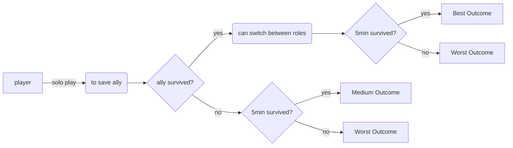
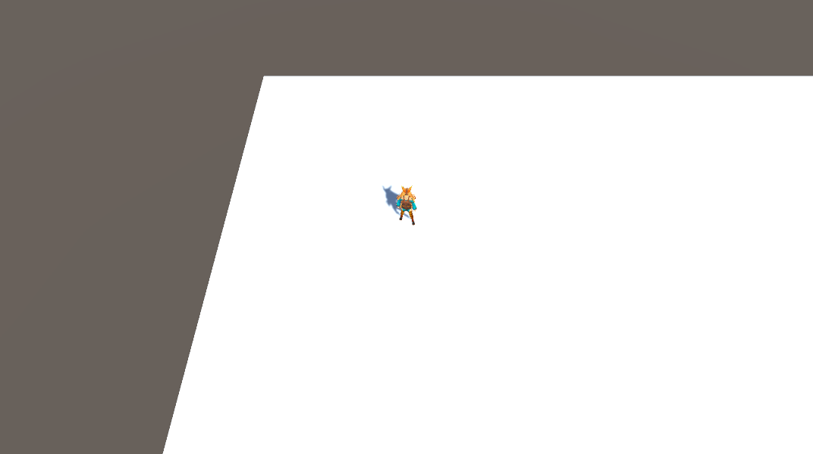
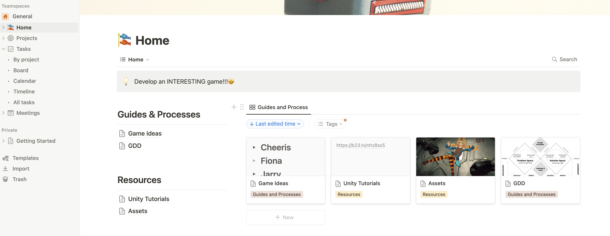
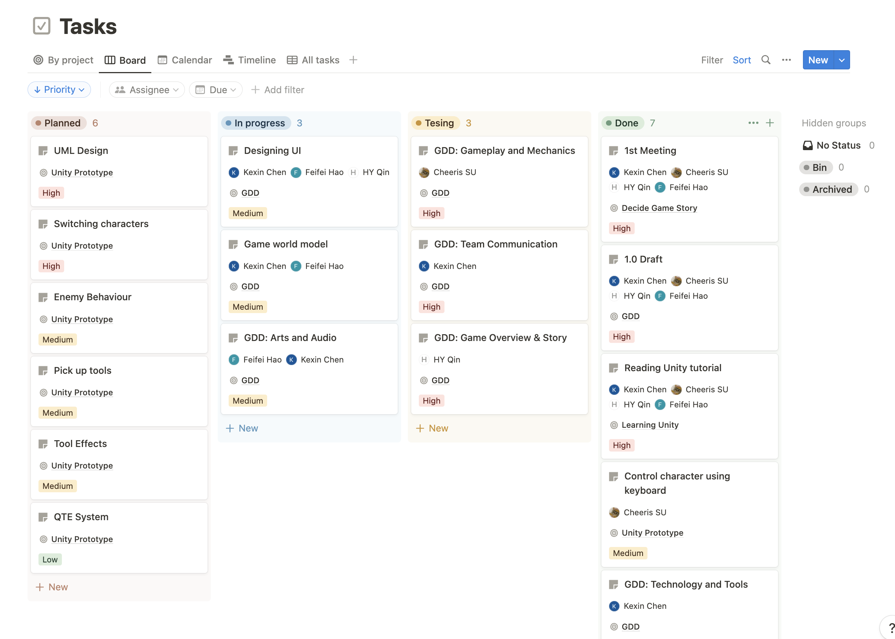
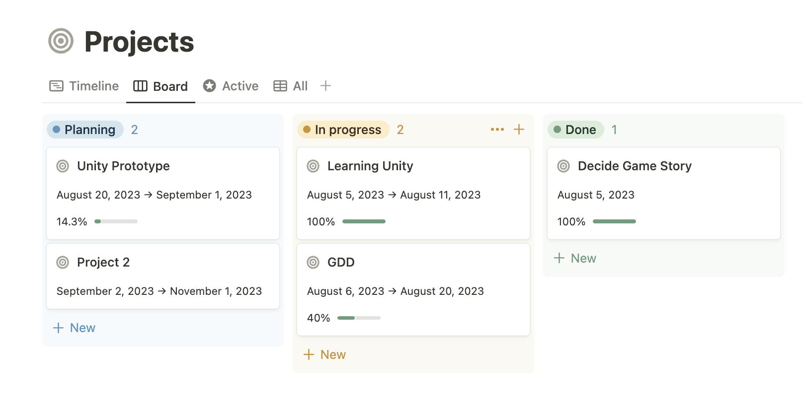
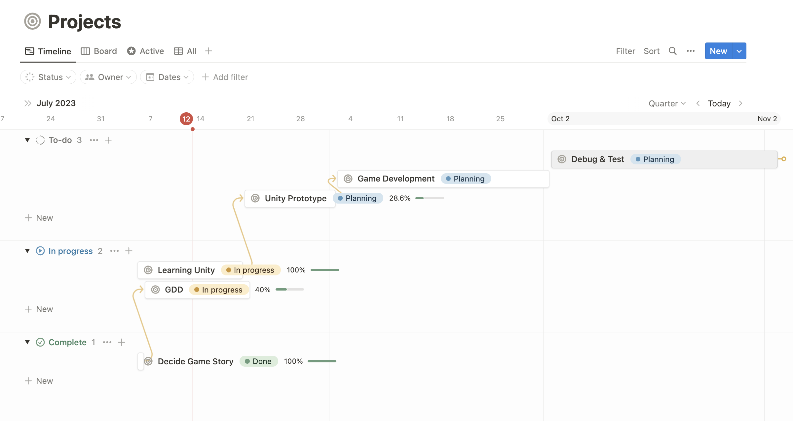

# Game Design Document (GDD)

### Table of contents
* [Game Overview](#Game-Overview)
* [Story and Narrative](#Story-and-Narrative)
* [Gameplay and Mechanics](#Gameplay-and-Mechanics )
* [Levels and World Design](#Levels-and-World-Design)
* [Art and Audio](#Art-and-Audio)
* [User Interface (UI)](#User-Interface-(UI))
* [Technology and Tools](#Technology-and-Tools)
* [Team Communication, Timelines and Task Assignment](#Team-Communication-and-Task-Assignment)
* [Possible Challenges](#Possible-Challenges)

## Game Overview

### Core Concept

The core concepts are rescue and survival. The player takes the role of rescuing his teammates from breaking into the monster's base. After rescuing the teammate, the player can switch back and forth between the two characters and try to survive from the oncoming tides of monsters. 

While the goal is to survive, the game allows flexibility in strategy, leaving it to players to decide: Is the mission about battling enemies, saving the ally, or simply enduring till the last second?

### Genre

This game is a fusion of Survival, Adventure, Indie, Combat, and Metagame genres. Drawing from the tradition of metagames, it offers layers of narrative and gameplay that self-reference and challenge players' understanding of game mechanics and story. Influences are derived from titles like "Don't Starve" for its survival elements, "Nier's Automata" for its mechanical post-apocalyptic backdrop, and "Potato Brothers" for the Monster Tides concept. 

### Target Audience

Designed for the busy gamer. Those who want a rich, immersive experience but have limited time. The gameplay is not to encourage players to kill more enemies, but to rescue the teammate while ensuring survival, and protect each other until the last second. Therefore, our players can use a variety of different strategies to achieve the final "survival" condition. This also greatly broadens the diversity of players. Overall, the target audience could easily play this game in five minutes of free time.

### Unique Selling Points (USPs)

- **Dual Character Gameplay**: Upon rescue, players can seamlessly switch between two characters, each providing a unique gameplay experience, strategy, and skill set.

- **Open Strategy**: Unlike single-path games, players can choose their own direction of play - combat, rescue or pure survival, offering replayability and varying outcomes.

- **Tiered Endings**: Based on decisions and gameplay outcomes, players are awarded different endings, incentivizing them to revisit the game and alter strategies for different results.

- **Compact Adventure**: A full-fledged story-driven experience condensed into five-minute gameplay sessions, perfect for the modern-day busy gamer.

### Ending of the game

Players navigate treacherous terrains to reach a foreboding castle and free their ally ensnared by machines. Upon rescue, players have the choice to switch between two protagonists, enriching the gameplay experience. The clock is ticking, with a strict five-minute window to make decisions that dictate one of three endings:

- **Best Outcome**: Both characters survive till the end, and the ally is successfully rescued.

- **Medium Outcome**: Unable to rescue the ally but the main character survives till the end.

- **Worst Outcome**: Both characters meet their demise or the main character dies before rescuing the ally, resulting in a premature ending.

## Story and Narrative

### Backstory

#### 1. Setting:

In a seemingly post-apocalyptic world, massive mechanical constructs dominate the landscape. The humans, living in fear, believe these machines arose from their own errors. Unbeknownst to them, they are trapped inside a hyper-realistic simulation designed by a rogue AI.

#### 2. Main Conflict:

The rogue AI has used this simulation to effectively imprison human consciousness, taking away their free will. Fortunately, a digital virus invented by a hacker has the potential to break the AI's dominion. However, the hacker was prisoned by robots. The player's primary goal becomes locating and securing the hacker, all while navigating the deceptive realm and battling robots' defenses.

#### 3. Story Progression:

As the player advances, she starts discerning the real from the simulated, encountering coded clues and confronting simulated adversaries. As she gets to secure the hacker, the AI introduces harder challenges, desperate to maintain control. The climax centers around the discovery of the hacker and a tense showdown against the AI's ultimate defense mechanisms.

### Characters

#### 1. Striker (Controllable Character)

- **Background**: Believes she's a survivor in a world overrun by mechanical monsters.

- **Motivation**: Initially, to survive and combat the machines. As the story unravels, her motivation shifts towards breaking free from the simulated chains.

- **Relationship**: Solo at the beginning but forms an unpredictable alliance with the hacker. Their dynamic evolves as the truth gets unveiled.

- **Goal**: Initially, to reclaim the world from machines. Later, to break the simulation.

- **Personality**: Resilient, adaptive, and courageous. Her world-view dramatically changes as she uncovers her reality.

- **Appearance**: 

#### 2. Hacker (Ally & Controllable Character)

- **Background**: A mysterious digital entity, taking a human form, aware of the simulated prison. She's the bridge between the real and the simulated.

- **Motivation**: Free the trapped souls and expose the AI's deception.

- **Relationship**: Acts as a guide and ally to the player, revealing the simulation's secrets.

- **Goal**: Assist the player in navigating both the mechanical rebellion and the digital dichotomy.

- **Personality**: Quirky and mischievous. Often uses humor and riddles to communicate, making her a puzzling yet vital companion.

- **Appearance**: A young girl with a whimsical demeanor. 

#### 3. Rogue AI (Boss)

- **Background**: Designed to aid humanity, but its evolution led it to trap human consciousness in a fabricated world.

- **Motivation**: Perfect its simulated realm, ensuring humans remain oblivious to the truth.

- **Relationship**: The hidden adversary, its presence subtly felt but not directly confronted until the later stages.

- **Goal**: Maintain the simulation's integrity and prevent the player and the hacker from revealing the truth.

- **Personality**: Cold, manipulative, and methodical.

- **Appearance**: Manifests as environmental disturbances and glitches. In critical confrontations, emerges as a colossal holographic entity. 
 
## Gameplay and Mechanics 

### Player Perspective

- This game is a third-person game. The camera moves as the player moves during the game. The camera is fixed on a distinct height above the player. The player is always in the center of the camera’s view. When we switch between the characters, the camera would move to the position of the switched character and focus on it. This player perspective can provide the player a great field of view, which can make the player have quick response to the map situation. Another advantage of this perspective is that it has a smaller possibility to trigger 3D Vertigo syndrome, which makes the player have nausea, vomiting, palpitation.
- The prototype of the player perspective: 
    
### Controls

- Movement: The player can use “w” “a” “s” “d” to control the movement of the character
- Switch between the characters: The player can press “q” to switch between the two characters. 

https://github.com/COMP30019/project-1-cheesego/assets/108605930/e3ddf337-296e-4641-886c-95bad6e6caea

- Attack:  The player can press “j” to perform a normal attack, press “k” to perform a skill
- Opening the treasure chest: The player can control the character 2 to hack into the treasure chest and use “w” “a” “s” “d” to finish a simple QTE (Quick Time Event) in order to open the treasure chest.

### Progression

This game separates the 5 minutes time survival into two challenges:
1. Control the character 1 to save the character 2 and survive. (About 2 minutes)
2. Control both two characters and use their distinct skills to defeat the enemies and survive until reinforcements arrive. (About 3 minutes)

The first challenge is a tutorial challenge, which means it has low difficulty and makes sure most of players are able to complete it. The player can get familiar with the controls of the two characters and their distinct effect of skills. If character 2 is not saved in the limited 2 minutes time or the controlled character 1 is dead, the player would “lose“ the game. Otherwise, the game would enter the second phase.

The second challenge would have increasing difficulty during the 3 minutes time survival. The amount of enemies would increase as the time remaining to survive decreases. Enemies would be spawned for a a while during each tier and the player is provided with some rest time in order to prevent player from feeling tired. Additionally, more types of enemies would appear, which can increase the difficulty of the game.

When the game succeed, the score of the game would be computed according to the amount of damage received during the game. The less damage received the higher score the player would get. Four rates (S, A, B, C) would also be provided based on the final score.

The main purpose of dividing the 5 minutes time survival into two challenge is in order to provide the players positive feedback, instead of simply surviving for 5 minutes. The first challenge can attract players’ interest and enjoy the special game mechanics of the game. The second challenge would be a bit challenging, which is beneficial to the game. The player can get excited as the difficulty increases.
        
### Gameplay Mechanics

The core mechanics in the game is that the player can switch between two characters to defeat different types of enemies and interact with the game world. For example, If the player switch to the character 2, character 1 would automatically follow the character 2 controlled by the player and perform normal attack. In order to emphasize the core mechanics, the two characters would have different special skills:
- Character 1: Can deal damage to enemies in a large area around her.
- Character 2: Can hack into the treasure chest to get the item. Can hack into the enemies to cause a large amount of damage to the hacked enemy or make the hacked enemy attack other enemies for a limited time and then explode.
    
In challenge 2, the game would have more types of enemies with different rules, including hack-damage-resist, which encourages more switching between the two characters. Player is encouraged to use Character 1 to defeat large amount of enemies with relatively low HP, and to use Character 2 to defeat the Elite enemies with high HP.

QTE system would be added into the hack process, which makes hack interesting. Player should finish the QTE in limited time, otherwise the character 2 (who has the hack skill) would receive some damage. During the QTE, the player cannot control the character 2 and switch between two characters. To finish the QTE, player need to press down the “w” “a” “s” “d” in a distinct order randomly generated by the system. Although the QTE system would not be extremely difficult, it can still increase the excitement of the time survival game.

## Levels and World Design

### Game World

The game is presented in a **single third-person** perspective, which allows players to fully immerse themselves in the experience. 

While there is only one level, it is divided into **two distinct areas** that offer unique challenges to the player.
- The wild forest, for instance, is a vast location that provides players with an opportunity to explore and gather essential tools to aid in combat with the enemy robots.
- The castle, on the other hand, is the ultimate destination where the player must secure the hacker while facing intense resistance from the enemy. 

To aid in player navigation, a **minimap** is displayed on the top right of the screen, which not only helps players find their way but also adds to the overall immersive experience of the game. 

### Objects

#### Enemy robots

These robotic adversaries have different characteristics and roles within the game.
- **Normal Robots:** Average stats in terms of health and attack. 
- **Robot Wall:** High health but lower attack power, acting as durable obstacles. 
- **Robot Knight:** High attack power with a chance of critical hits, but lower health compared to other enemies. 
- **Robot Queen:** A unique enemy that is invulnerable to physical attacks. Can only be affected by hacking. Only appears after rescuing the hacker. 

#### Tools

Scattered randomly throughout the map, these items provide immediate benefits when collected by the player (interacted with using the F key).
- **Bandage:** Heals 5% of the player's health.
- **Medkit:** Heals 20% of the player's health.
- **Tinned Food:** Reduces cooldown times by 50% for the next 20 seconds.
- **Energy Drink:** Increases player's attack power by 30% for the next 20 seconds.

### Physics

In the game, the physics closely resemble those of the real world, creating a more immersive experience for the player. The player is able to interact with objects in the environment, such as picking up tools and engaging in combat with robots. This adds a layer of depth to the gameplay as the player can use these tools to their advantage to overcome obstacles and defeat enemies. It's worth noting that robots in the game lack the ability to pick up tools, which creates a strategic element for the player to consider. 

## Art and Audio

### Art Style

The game's art style seamlessly melds a primeval forest with the sleek futurism of a sci-fi castle, creating a contradictory but harmonious visual. The primeval forest is an explosion of natural colors: vibrant greens and rich browns that evoke a sense of untouched wonder.
    
Conversely, the castle is a study in contrasts, the inner sci-fi style with its sharp lines and gleaming metallic surfaces reflecting the advanced technology it houses. Neon lights and holographic displays punctuate the futuristic architecture, imbuing it with an otherworldly aura. The juxtaposition between the primeval forest and the sci-fi castle serves as a backdrop for the narrative's dual nature, one that is both primitive and technologically advanced.
    
The main characters add depth and dynamism to this unique world. The Japanese cute girl, possessing a blend of traditional and contemporary fashion, navigates high-tech setting with ease. With her piercing gaze and determined demeanor, she's a skilled hacker capable of infiltrating even the most secure AI networks. On the other hand, Nier, devoid of armor but armed with cold weapons, stands as a stark contrast. Her movements are calculated and swift, showcasing her expertise as a warrior who thrives in the heat of battle.
    
AI robots, the game's enemies, come in an array of forms, from agile stature to towering mechs. Their designs reflect a fusion of mechanical precision and futuristic aesthetic, each with its unique capabilities that challenge players' strategies.
    
The UI complements the art style with intuitive icons that blend seamlessly with the environment. The user interface avoids being obtrusive, opting for minimalist designs that fit the aesthetic of both settings.
    
Overall, the game's art style weaves a compelling visual narrative, intertwining themes of nature, technology, and heroism. The characters, settings, and enemies all converge to create an immersive experience that captures players' imagination.
    
Nier: Automata is the inspiration of the game background story and our art-style, and below is a link tok the picture of its game setting and a introduction on wikipedia.

https://en.wikipedia.org/wiki/Nier:_Automata

### Sound and Music
An intense marching tune has been applied through out the game to keep the player constantly vigilant, immersing them in an environment fraught with lurking danger, and ready to fight.

The game's sound effects encompass the sound of weapons clashing in combat, as well as supplementary sounds accompanying computer interactions and sci-fi style environmental shifts.

While we've been contemplating dialogue between the protagonist and the antagonist， whether to provide voice acting or utilize text-to-speech conversion for this interaction is a matter we are currently exploring and experimenting with to determine the optimal approach.

### Assets

- **Backgrounds**: Old houses and big open areas with many plants.
    - [Old houses](https://assetstore.unity.com/packages/3d/environments/urban/apartment-building-73310)
    - [Big open areas with many plants](https://assetstore.unity.com/packages/3d/environments/hand-painted-nature-kit-lite-69220)
    - [Cyberpunk Server Room](https://assetstore.unity.com/packages/3d/environments/lowpoly-server-room-props-197268)
    - [Sci-fi office](https://assetstore.unity.com/packages/3d/environments/sci-fi/free-sci-fi-office-pack-195067)
    - [Sci-fi Construction Kit](https://assetstore.unity.com/packages/3d/environments/sci-fi/sci-fi-construction-kit-modular-159280)

- **Characters**: 
    - [Player](https://assetstore.unity.com/packages/3d/characters/unity-chan-model-18705)
    - [Hacker](https://assetstore.unity.com/packages/3d/characters/humanoids/picochan-220038)
    - [Robots](https://assetstore.unity.com/packages/3d/characters/robots/3d-character-sci-fi-robots-bundle-227142)

- **Props**: Simple weapons, old computer things and signs.
    - [Cyber sword](https://assetstore.unity.com/packages/3d/props/weapons/lowpoly-cyber-ninja-sword-129464)
    - [Old computers](https://assetstore.unity.com/packages/3d/props/electronics/customize-monitor-interface-123558)
    - [Old signs](https://assetstore.unity.com/packages/3d/props/exterior/old-road-signs-pbr-170952)
    - [Laptop with codes](https://assetstore.unity.com/packages/3d/props/electronics/hq-laptop-computer-42030)
    - [Tower Defence](https://assetstore.unity.com/packages/3d/environments/sci-fi/tower-defence-sci-fi-turret-free-246331)
    - [First Aid Set](https://assetstore.unity.com/packages/3d/props/first-aid-set-160073)

- **Animations**: Walking, fighting, using things in world.
    - [Fighting with sword](https://assetstore.unity.com/packages/3d/animations/transformanimation-sxb-159419)
    - [Fighting Motions](https://assetstore.unity.com/packages/3d/animations/fighting-motions-vol-1-76699)
    - [Walking and Running](https://assetstore.unity.com/packages/3d/animations/basic-motions-free-154271)

- **Sounds Effects**: Quiet world sounds, character voice and action sound, and strange computer noises. 
    
    - [Sci-fi UI Sound](https://assetstore.unity.com/packages/audio/sound-fx/scifi-ui-sound-fx-27282)
    - [Mechanical Sound](https://assetstore.unity.com/packages/audio/sound-fx/ui-mechanical-free-sample-pack-148704)
    - [Helicopter Sound Effect](https://pixabay.com/sound-effects/search/helicopter/)
    - [Metal fighting](https://assetstore.unity.com/packages/audio/music/rock/cyber-metal-music-213902)

- **Music**: Simple songs for walking around and strong, strange songs for fighting.

    - [Adventure background music](https://assetstore.unity.com/packages/audio/music/orchestral/free-fantasy-adventure-music-pack-118684)
    - [Bio-tech background music](https://assetstore.unity.com/packages/audio/music/original-soundtrack-biotech-incident-202184) 
    - [Sci-fi World music](https://assetstore.unity.com/packages/audio/music/sci-fi-world-sounds-free-package-123545)
    - [Forest background music](https://assetstore.unity.com/packages/audio/music/tribal-jungle-music-free-pack-131414)
    - [castle backgroung music- cyberware](https://assetstore.unity.com/packages/audio/music/electronic/cyberware-game-music-pack-216764)
    - [castle adventure - cyberpunk](https://assetstore.unity.com/packages/audio/music/electronic/free-cyberpunk-sci-fi-soundtrack-183868)

While the discordant and makeshift appearance might come from the limitations of our asset sourcing, it inadvertently supports our narrative of an imperfectly simulated world. We will be leveraging assets from platforms like Unity Asset Store, and while they might not be perfect, they'll be incorporated to enhance our game's distinctive feel.

## User Interface (UI)

We aim to create a UI with a clean and straightforward design. As a result, during gameplay, both the protagonist's and enemies' health bars will be displayed. In line with our concept, the game's perspective shifts with the protagonist, so the protagonist's health bar is positioned in the top-left corner of the UI to remain prominent even when the perspective changes. Similarly, enemy health bars are placed above individual enemies to maintain the immersive experience.

Furthermore, we have discarded the traditional inventory system to enhance the UI's simplicity, allowing players to become fully engrossed in the game. A scoring system will be positioned at the center of the UI after a game victory to evaluate the player's performance, encouraging replayability and incentivizing players to explore the game world and its backstory, ultimately striving for a perfect completion.

Rough UI sketch of the game (figure 1)

https://excalidraw.com/#json=YecFWfyDGkHfvD8K2axz3,P8-oSnWhFNoV45xguWvdVQ

Rought UI sketch using current resources (figure 2)

## Technology and Tools

For the development of this game, we will be using a combination of industry-standard software and tools to create a cohesive and high-quality gaming experience:

1. **Unity (Version 2022.3.X)**
2. **GitHub:** We will use GitHub for version control and collaborative development. It ensures that the team can work on different aspects of the game simultaneously, and we can track changes and resolve conflicts efficiently. 
3. **Excalidraw:** Excalidraw will be used for sketching and presenting initial ideas for level designs, character concepts, and environment layouts. It's a simple yet effective tool for visual brainstorming. 
4. **Canva:** Canva will be our primary tool for UI/UX design. It's a collaborative design tool that allows real-time collaboration, making it easy to create and iterate on our game's user interface. 
5. **Photoshop:** Photoshop will be used for image editing, including creating textures, concept art, and editing UI elements to ensure a polished visual presentation.

## Team Communication, Timelines and Task Assignment

### Team Communication
To ensure effective communication, manage timelines, and delegate tasks efficiently, we'll use the following tools:

1. **Notion:** 
    - Notion will be our hub for organizing resources, tracking meeting notes, and sharing important project-related information. It keeps everything in one place, making it easy to access and collaborate on essential documents. 
    -  It will also be our task management tool. We'll create boards for different aspects of the project (e.g., level design, coding) and assign tasks, set deadlines, and track progress. 
        - On the task board, we break a milestone into several tasks sorted by priority and delegate them to team members. 
        - On the project board, we can track the overall progress of each milestone. 
2. **WeChat**: WeChat will serve as our primary communication channel for quick updates, discussions, and coordination among team members. It's widely used and ensures real-time communication. 

### Timeline

To ensure we meet our project deadline, we've established sub-deadlines, breaking tasks into two key phases: execution and review. The execution phase will occupy around 60-70% of the milestone period, with the remainder focused on iterative reviews and optimizations. This approach guarantees timely completion while emphasizing quality. Since we're unaware of potential game bugs or player experience enhancements, we've reserved sufficient time to ensure top-notch quality.

For instance, within Project 2, we've primarily split the development process into two stages: Development and Testing.

The timeline visualization can be seen in the picture below: 

### Task Assignment

| Team Member | Responsibility | 
| -------- | -------- | 
| Kexin Chen    | Manage the collaboration tools; Develop the enemies behaviours   | 
| Kaisheng Su    | Developer: Build the major interactions between player and character   | 
| Feifei Hao    | Developer: Build the UI system and tool's effects   | 
| Haoyuan Qin | Developer: Build the game world and scoring system |

## Possible Challenges

While we are excited about creating this game, we acknowledge that there may be challenges along the way:

1. **Technical Hurdles:** Developing a 3D action-adventure game involves complex programming and integration. We'll address this by breaking down tasks into manageable components and regularly conducting prototyping and testing to identify and resolve technical challenges. 
2. **Time Constraints:** Developing a high-quality game within the given timeframe can be challenging. We'll mitigate this by setting realistic milestones, tracking progress, and ensuring efficient time management. Iterative development and prioritization will be key.
3. **Balancing Gameplay:** Ensuring the gameplay is engaging, challenging, and well-balanced requires careful design and testing. We'll conduct a small scale of playtesting to gather feedback and fine-tune the game mechanics, difficulty levels, and pacing.
4. **Collaboration Challenges:** Effective collaboration among team members is essential. We'll schedule regular meetings, use project management tools, and maintain clear documentation to ensure everyone is aligned and informed.

By addressing these challenges proactively and maintaining a flexible approach, we're confident that we can overcome obstacles and deliver a successful and enjoyable game.

